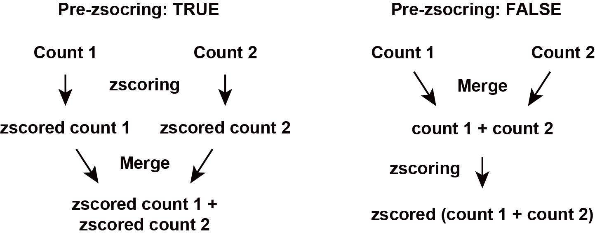
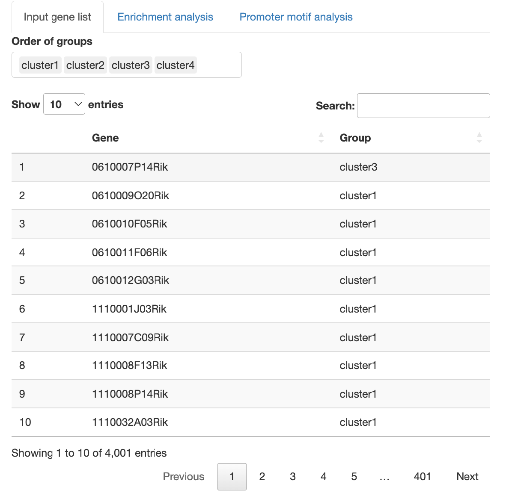

```{r setup, include=FALSE}
source("global.R")
library(biomaRt)
library(monaLisa)
library(GenomicRanges)
library(BiocParallel)
library(SummarizedExperiment)
library(JASPAR2020)
library(TFBSTools)
library(BSgenome.Mmusculus.UCSC.mm10)
library(BSgenome.Hsapiens.UCSC.hg19)
library(TxDb.Mmusculus.UCSC.mm10.knownGene)
library(TxDb.Hsapiens.UCSC.hg19.knownGene)
knitr::opts_chunk$set(echo = TRUE)
``` 

---

[](https://doi.org/10.5281/zenodo.7095218)<br>

# 概要

{#id .class width=70%} <br><br>

RNAseqChefは、RNA-seqにより得たカウントデータを自動的に解析・可視化するウェブアプリです。
単一のデータセットの解析だけでなく、複数のデータセットの結果を統合解析することも可能です。
また、RNA-seqのカウントデータからChIP-seqやATAC-seqの解析で得た遺伝子セットを抽出・解析するマルチオミクスな解析も可能です。<br>
Publication-readyな高解像度Figure（イラストレーターで編集可能なPDFファイル）をダウンロードすることができます。<br><br>
RNAseqChefは、以下の方法で使用可能です。<br>
方法1. 下記ウェブページへアクセス <br>
方法2. 下記ソースコードページの「Local installation」に記載されているコードをRで実行 <br><br>

ウェブページ: https://imeg-ku.shinyapps.io/RNAseqChef/ <br>
ソースコード: https://github.com/Kan-E/RNAseqChef <br>
Manual (English): https://kan-e.github.io/RNAseqChef_manual <br>
問い合わせ先: Kan Etoh, kaneto@kumamoto-u.ac.jp <br><br><br>


本アプリは以下のセクションにより構成されます。<br>

- **Pair-wise DEG** (２群間比較の遺伝子発現変動解析)

- **3 conditions DEG** (３群間多重比較の遺伝子発現変動解析)

- **Multi DEG** (尤度比検定による遺伝子発現変動解析)

- **Venn diagram** (複数の遺伝子セットから共通遺伝子の抽出・複数のカウントデータを統合したヒートマップの作成)

- **Normalized count analysis** (normalized countデータを用いたクラスタリング解析、遺伝子セットの抽出)

- **Enrichment viewer** (遺伝子セットの機能解析)

- **More**（その他の便利機能やReferenceなど）

アプリはメニュー、セッティングパネル、アウトプットパネルの3種類のパネルで構成されています。<br>
各セクションはアプリ上部のメニューボタンをクリックすることで移動できます。<br>
解析を実行するファイルは、セッティングパネルからアップロードすることができます。<br>
解析は、アウトプットパネルのタブパネルをクリックすることで実行されます。<br><br>
{#id .class width=70%} <br>

---

# Input fileの共通ルール・注意点

#### 拡張子

タブ区切りtxt file (.txt)、カンマ区切りcsv file (.csv)、エクセルファイル (.xlsx)に対応します。<br><br>

#### 遺伝子名の重複

エクセルの自動書式機能が遺伝子名の誤変換を引き起こすケースがあります。<br>
エクセルのバージョンによっては、**ただファイルを開くだけで遺伝子名の変換・重複が起こります**（March1 → 1-Mar, Marc1 → 1-Marなど）。<br>
RNAseqChefでは、遺伝子名の重複を含むファイルは解析できません（Enrichment viewerを除く）。<br>
エクセルでファイルを編集する場合は、遺伝子の誤変換が起きていないことを確認してください。<br><br>

---

# Output fileの共通ルール・注意点

#### データの保存

ダウンロードボタンを押すことで、テーブルデータやグラフが保存されます。
表データはタブ区切りtxt file(.txt)、グラフはイラストレーターで編集可能なPDFファイルで保存されます。<br>
pair-wise DEGのbatch modeのみ、zip形式で複数のファイルが保存されます。<br><br>

#### 保存されるグラフのサイズ調整

Setting panelの「Output plot size setting for pdf」を調整することで保存される図のサイズを変更できます。<br>
グラフ内で隣り合う文字が重なってしまう場合やグラフの余白が大きすぎる場合にパラメーターを調整して下さい。<br>
パラメーターの値が0の場合、デフォルトサイズで保存されます。<br>
デフォルトサイズは、図の種類によって異なります。詳細は、アプリ内のポップアップからご覧ください。<br><br>

---

# Pair-wise DEG

２群間の比較解析を実行します。DEG（発現変動遺伝子）の同定・可視化・機能解析結果を出力します。

## Setting

{#id .class width=50%}<br>

---

### Input format

inputとなるraw countデータの形式は3種類あります。<br>
下図のようにボタンを押すことで、アップロードの様式が切り替わります。
{#id .class width=100%}<br>
   
#### 1. **raw count データのみ** <br>
以下の条件を満たす場合、raw countデータのみで解析を実行できます。
   
    - 解析対象となる２群のデータのみで構成されるファイル
    - サンプル名のn数は、アンダーバー「 _ 」を用いて表記する
    - アンダーバー「 _ 」は、n数の表記以外では使用しない
{#id .class width=50%}
<br>　

---
   
#### 2. **raw count データ + メタデータ** <br>
サンプル名がaccession numberである場合や余分な情報が含まれるraw countデータである場合に使用します。<br>
メタデータは以下の情報を含む必要があります。
   
    - １列目は、raw countデータで使用されているサンプル名（例: accession number）
    - ２列目は、対応するサンプル名 (例: Control_1)
    - ３列目以降は、解析に影響しません 
メタデータ２列目のサンプル名は、n数表記（例："_1"）は必須ではありません。
n数表記がない場合には、自動的にナンバリングされます（上から順に"_1","_2"...と割り振られます）。
{#id .class width=50%}
<br><br>
   
#### 3. **raw count データのみ (バッチモード)** <br>
以下の条件を満たす場合、複数のraw countデータを一括処理できます。
   
    - 解析対象となる２群のデータのみで構成されるファイル
    - サンプル名のn数は、アンダーバー「 _ 」を用いて表記する
    - アンダーバー「 _ 」は、n数の表記以外では使用しない

バッチモードでは、Output panelに結果が表示されません。    
Downloadボタンをクリックすることで、Clustering, MA_plot, DEG_result, 発現量が増加した遺伝子のカウントデータ、発現量が減少した遺伝子のカウントデータ、normalizedカウントデータ、がzip形式で出力されます。
{#id .class width=50%}
<br>　

---
   
#### DEG analysis method
本アプリでは、3種類のDEG解析を実行できます。

- [DESeq2](https://genomebiology.biomedcentral.com/articles/10.1186/s13059-014-0550-8)
- [edgeR](https://academic.oup.com/bioinformatics/article/26/1/139/182458)
- [EBSeq](https://academic.oup.com/bioinformatics/article/29/8/1035/228913)
<br>

#### FDR method
DEG analysis methodがDESeq2またはedgeRの場合、3種類のFDR methodが選べます。

- BH, Benjamini-Hochberg法 (default)
- Qvalue, Storey法
- [IHW, Independent Hypothesis Weighting](https://www.nature.com/articles/nmeth.3885)
<br> 

#### Species
データセットの種を選択することで以下の解析が実行されます。

    - 遺伝子名がENSEMBL IDの場合、gene symbolへの変換
    - エンリッチメント解析の実行
<br>  
    
#### Cut-off conditions
Fold change, FDR, basemeanの閾値が設定できます。
<br>  <br> 
    
#### Option: normalized count input
TPMカウントなどのnormalized countデータを用いてbasemean cut-offやボックスプロットを表示することができます。<br>
注: raw countデータが不要になるわけではありません。
<br>  <br> 

---

## Output

### Input Data

アップロードしたraw countデータを表示します。
メタデータをアップロードした場合、メタデータとそのメタデータの情報を用いて抽出したraw countデータも表示します。
<br><br>
{#id .class width=70%}<br><br>

---

### Result overview

Principal Component Analysis (PCA)、Multi-Dimensional Scaling (MDS), ward.D2による階層的クラスタリングの3種類のクラスタリング解析を実行します。<br>
DEG解析の結果をMA-plotとheatmapで表示します。<br>
表データとして、DEG解析の結果やDEGのカウントデータが出力されます。<br><br>
{#id .class width=70%}
<br><br>

---

### GOI (Genes of interest) profiling

Volcano plotを表示します。<br>
GOI listから遺伝子を選択することで、volcano plotで表示される点のうち、目的の遺伝子だけをラベルすることができます。<br>
x軸、y軸のレンジはスライドバーを操作することで自由に変更できます。<br>
また、GOI listから選択された遺伝子のheatmapおよびboxplotが表示されます。<br><br>
{#id .class width=70%}<br>
{#id .class width=70%}
<br>

---

### Enrichment analysis

エンリッチメント解析によりDEGの機能を同定します。<br>
解析に使用できる遺伝子セットは、以下の通りです。<br>
[MSigDB hallmark gene](http://www.gsea-msigdb.org/gsea/msigdb/genesets.jsp?collection=H) <br>
[KEGG](https://www.kegg.jp) <br>
[Reactome](https://reactome.org) <br>
[PID (Pathway Interaction Database)](https://maayanlab.cloud/Harmonizome/resource/Pathway+Interaction+Database) <br>
[BioCarta](https://maayanlab.cloud/Harmonizome/dataset/Biocarta+Pathways) <br>
[WikiPathways](https://www.wikipathways.org/index.php/WikiPathways) <br>
[GO (biological process, cellular component, and molecular function)](http://geneontology.org)  <br>
[Human phenotype ontology](https://hpo.jax.org/app/)  <br>
[DoRothEA regulon (activator)](https://saezlab.github.io/dorothea/) <br>
[DoRothEA regulon (repressor)](https://saezlab.github.io/dorothea/) <br>
[Transcription factor targets](http://www.gsea-msigdb.org/gsea/msigdb/genesets.jsp?collection=TFT) <br>
[miRNA target](http://www.gsea-msigdb.org/gsea/msigdb/genesets.jsp?collection=MIR) <br>
注) 転写因子の予測解析は**DoRothEA regulon**の使用を推奨します。

解析結果として、over-representative analysis, GSEA (gene set enrichment analysis), gene-concept network (cnet) plotが出力されます。 <br>
解析は、[ClusterProfiler](https://yulab-smu.top/biomedical-knowledge-mining-book/enrichplot.html)に依存します。
{#id .class width=70%}<br>

---

# 3 conditions DEG

EBSeqによる多重比較解析を実行することで、３群間のDEGを同時に検出・可視化・機能解析結果を出力します。<br>
注： 多重比較解析は時間がかかります（５〜１０分）。

## Setting


{#id .class width=50%}<br>

---

### Input format

3conditions DEGのinput formatや設定は、pair-wise DEGと全く同様です。<br>
pair-wise DEGの説明を読んだ方は、読む必要はありません。<br>

inputとなるraw countデータの形式は2種類あります。<br>

#### 1. **raw count データのみ** <br>
以下の条件を満たす場合、raw countデータのみで解析を実行できます。
   
    - 解析対象となる３群のデータのみで構成されるファイル
    - サンプル名のn数は、アンダーバー「 _ 」を用いて表記する
    - アンダーバー「 _ 」は、n数の表記以外では使用しない
{#id .class width=50%}
<br>　

---
   
#### 2. **raw count データ + メタデータ** <br>
サンプル名がaccession numberある場合や余分な情報が含まれるraw countデータである場合に使用します。<br>
メタデータは以下の情報を含む必要があります。
   
    - １列目は、raw countデータで使用されているサンプル名（例: accession number）
    - ２列目は、対応するサンプル名 (例: Control_1)
    - ３列目以降は、解析に影響しません 
メタデータ２列目のサンプル名は、n数表記（例："_1"）は必須ではありません。
n数表記がない場合には、自動的にナンバリングされます（上から順に"_1","_2"...と割り振られます）。
{#id .class width=50%}
<br><br>
   
---
   
#### Species
データセットの種を選択することで以下の解析が実行されます。

    - 遺伝子名がENSEMBL IDの場合、gene symbolへの変換
    - Enrichment analysisの実行
<br>  
    
#### Cut-off conditions
Fold change, FDR, basemeanの閾値が設定できます。
<br>  <br> 
    
#### Option: normalized count input
TPMカウントなどのnormalized countデータを用いてbasemean cut-offやボックスプロットを表示することができます。<br>
注: raw countデータが不要になるわけではありません。
<br>  <br> 

---

## Output

### Input Data

アップロードしたraw countデータを表示します。
メタデータをアップロードした場合、メタデータとそのメタデータの情報を用いて抽出したraw countデータも表示します。
<br><br>
{#id .class width=60%}

---

### Result overview

Principal Component Analysis (PCA)、Multi-Dimensional Scaling (MDS), ward.D2による階層的クラスタリングの3種類のクラスタリング解析を実行します。<br>
DEG解析の結果をscatter plotとheatmapで表示します。<br>
3条件総当たりで遺伝子発現変動を可視化することで、各条件の遺伝子発現の特徴を抽出できます。<br>
また、DEG解析の結果やDEGのカウントデータが出力されます。<br><br>
{#id .class width=70%}<br>
{#id .class width=70%}<br>
{#id .class width=70%}
<br>

---

### GOI (Genes of interest) profiling

GOI listから選択された遺伝子のheatmapおよびboxplotが表示されます。<br><br>
{#id .class width=70%}<br>
{#id .class width=70%}<br>

---

### Enrichment analysis

Enrichment analysisによりDEGの機能を同定します。<br>
解析に使用できる遺伝子セットは、以下の通りです。<br>
[MSigDB hallmark gene](http://www.gsea-msigdb.org/gsea/msigdb/genesets.jsp?collection=H) <br>
[KEGG](https://www.kegg.jp) <br>
[Reactome](https://reactome.org) <br>
[PID (Pathway Interaction Database)](https://maayanlab.cloud/Harmonizome/resource/Pathway+Interaction+Database) <br>
[BioCarta](https://maayanlab.cloud/Harmonizome/dataset/Biocarta+Pathways) <br>
[WikiPathways](https://www.wikipathways.org/index.php/WikiPathways) <br>
[GO (biological process, cellular component, and molecular function)](http://geneontology.org)  <br>
[Human phenotype ontology](https://hpo.jax.org/app/)  <br>
[DoRothEA regulon (activator)](https://saezlab.github.io/dorothea/) <br>
[DoRothEA regulon (repressor)](https://saezlab.github.io/dorothea/) <br>
[Transcription factor targets](http://www.gsea-msigdb.org/gsea/msigdb/genesets.jsp?collection=TFT) <br>
[miRNA target](http://www.gsea-msigdb.org/gsea/msigdb/genesets.jsp?collection=MIR) <br>
注) 転写因子の予測解析は**DoRothEA regulon**の使用を推奨します。

解析は、over-representative analysis, gene-concept network (cnet) plotが実行されます。 <br>
解析は、[ClusterProfiler](https://yulab-smu.top/biomedical-knowledge-mining-book/enrichplot.html)に依存します。<br><br>

{#id .class width=70%} <br>
{#id .class width=70%} <br>

---

# Multi DEG

DESeq2 LRT(Likelihood Ratio Test: 尤度比検定)を実行することで、発現変動遺伝子を検出・可視化・機能解析結果を出力します。<br>
注： 個々の群間の検定は行いません。

## Setting


{#id .class width=50%}<br>

---

### Input format

inputとなるraw countデータの形式は2種類あります。<br>

#### 1. **raw count データのみ** <br>
以下の条件を満たす場合、raw countデータのみで解析を実行できます。
   
    - 解析対象のデータのみで構成されるファイル
    - サンプル名のn数は、アンダーバー「 _ 」を用いて表記する
    - アンダーバー「 _ 」は、n数の表記以外では使用しない
{#id .class width=50%}
<br>　

---
   
#### 2. **raw count データ + メタデータ** <br>
2-factorの比較・可視化をしたい場合に使用します。<br>
メタデータは以下の情報を含む必要があります。
   
    - １列目は、raw countデータで使用されているサンプル名
    - １列目のサンプル名は、n数の情報を含む（アンダーバー「 _ 」を用いて表記する）
    - ２列目は、対応するサンプルの条件1 (例: time)
    - ３列目は、対応するサンプルの条件2 (例: genotype)
{#id .class width=50%}
<br><br>
   
---

#### FDR method
3種類のFDR methodが選べます。

- BH, Benjamini-Hochberg法 (default)
- Qvalue, Storey法
- [IHW, Independent Hypothesis Weighting](https://www.nature.com/articles/nmeth.3885)
<br> 
   
#### Species
データセットの種を選択することで以下の解析が実行されます。

    - 遺伝子名がENSEMBL IDの場合、gene symbolへの変換
    - Enrichment analysisの実行
<br>  
    
#### Cut-off conditions
Fold change, FDR, basemeanの閾値が設定できます。
<br>  <br> 
    
#### Option: normalized count input
TPMカウントなどのnormalized countデータを用いてbasemean cut-offやボックスプロットを表示することができます。<br>
注: raw countデータが不要になるわけではありません。
<br>  <br> 

---

## Output

### Input Data

アップロードしたraw countデータを表示します。
メタデータをアップロードした場合、メタデータとそのメタデータの情報を用いて抽出したraw countデータも表示します。
<br>
{#id .class width=60%}
{#id .class width=60%}<br>

---

### Result overview

Principal Component Analysis (PCA)、Multi-Dimensional Scaling (MDS), ward.D2による階層的クラスタリング、UMAP(Uniform Manifold Approximation and Projection)の４種類のクラスタリング解析を実行します。<br>
DEG解析の結果をheatmapで表示します。<br>
また、DEG解析の結果やDEGのカウントデータが出力されます。<br>

UMAPのn_neighborsは、多様体構造の局所近似で使用される近傍点の数です。<br>
小さくすると局所構造、大きくすると大域的な構造を保持します。<br>
サンプル数が少ない場合は、n_neighborsを小さくする必要があります。<br><br>
{#id .class width=70%}<br>
{#id .class width=70%}<br>


---

### Divisive clustering

分割型(top-down)アプローチによる階層的クラスタリングを実行します。<br>
クラスターの数は自動的に決定されます。<br>
それぞれのクラスターの発現パターンをボックスプロットで表示します。<br>
遺伝子とクラスターの対応関係をテーブルデータとして出力します。<br>
また、Enrichment analysisにより各クラスターの遺伝子の機能を同定します。<br>
解析に使用できる遺伝子セットは、以下の通りです。<br>
[MSigDB hallmark gene](http://www.gsea-msigdb.org/gsea/msigdb/genesets.jsp?collection=H) <br>
[KEGG](https://www.kegg.jp) <br>
[Reactome](https://reactome.org) <br>
[PID (Pathway Interaction Database)](https://maayanlab.cloud/Harmonizome/resource/Pathway+Interaction+Database) <br>
[BioCarta](https://maayanlab.cloud/Harmonizome/dataset/Biocarta+Pathways) <br>
[WikiPathways](https://www.wikipathways.org/index.php/WikiPathways) <br>
[GO (biological process, cellular component, and molecular function)](http://geneontology.org)  <br>
[Human phenotype ontology](https://hpo.jax.org/app/)  <br>
[DoRothEA regulon (activator)](https://saezlab.github.io/dorothea/) <br>
[DoRothEA regulon (repressor)](https://saezlab.github.io/dorothea/) <br>
[Transcription factor targets](http://www.gsea-msigdb.org/gsea/msigdb/genesets.jsp?collection=TFT) <br>
[miRNA target](http://www.gsea-msigdb.org/gsea/msigdb/genesets.jsp?collection=MIR) <br>
注) 転写因子の予測解析は**DoRothEA regulon**の使用を推奨します。

解析は、over-representative analysis, gene-concept network (cnet) plotが実行されます。 <br>
解析は、[ClusterProfiler](https://yulab-smu.top/biomedical-knowledge-mining-book/enrichplot.html)に依存します。<br><br>


**Select a pair for fold change cut-off**について<br>
選択された2群間のFold ChangeがCut-off condition(Setting panel)の対象となります。<br>
特定の群間でのみ大きく変化する遺伝子を抽出したい場合に有効な機能となります。<br>

**The DEG number after the filtration**について<br>
Cut-off後のDEGの数が表示されます。<br>

**Most significant genes**について<br>
Cut-off後のDEGをFDRが低い順から抽出し、クラスタリング解析を実行します。<br>
Cut-off後のDEGが多すぎる場合、サーバーメモリの都合上フリーズする恐れがあるため、解析対象の遺伝子を絞り込みます。<br>


{#id .class width=50%}<br>
{#id .class width=50%}<br>
{#id .class width=50%}<br>
{#id .class width=50%}<br>
{#id .class width=50%}<br>
{#id .class width=50%}<br>

---

### k-means clustering
k-means clusteringを実行します。<br>
クラスターの数は、スライドバーを操作することで変更できます。<br>
それぞれのクラスターの発現パターンをボックスプロットで表示します。<br>
遺伝子とクラスターの対応関係をテーブルデータとして出力します。<br>
また、Enrichment analysisにより各クラスターの遺伝子の機能を同定します。<br>

**Select a pair for fold change cut-off**について<br>
選択された2群間のFold ChangeがCut-off condition(Setting panel)の対象となります。<br>
特定の群間でのみ大きく変化する遺伝子を抽出したい場合に有効な機能となります。<br>

**The DEG number after the filtration**について<br>
Cut-off後のDEGの数が表示されます。<br>

**Most significant genes**について<br>
Cut-off後のDEGをFDRが低い順から抽出し、クラスタリング解析を実行します。<br>
Cut-off後のDEGが多すぎる場合、サーバーメモリの都合上フリーズする恐れがあるため、解析対象の遺伝子を絞り込みます。<br>

{#id .class width=60%}<br>
{#id .class width=60%}<br>
{#id .class width=60%}<br>
{#id .class width=60%}<br>
{#id .class width=60%}<br>
{#id .class width=60%}<br>

---

### GSEA 

GSEA (gene set enrichment analysis)によりDEGの機能を同定します。<br>
解析に使用できる遺伝子セットは、以下の通りです。<br>
[MSigDB hallmark gene](http://www.gsea-msigdb.org/gsea/msigdb/genesets.jsp?collection=H) <br>
[KEGG](https://www.kegg.jp) <br>
[Reactome](https://reactome.org) <br>
[PID (Pathway Interaction Database)](https://maayanlab.cloud/Harmonizome/resource/Pathway+Interaction+Database) <br>
[BioCarta](https://maayanlab.cloud/Harmonizome/dataset/Biocarta+Pathways) <br>
[WikiPathways](https://www.wikipathways.org/index.php/WikiPathways) <br>
[GO (biological process, cellular component, and molecular function)](http://geneontology.org)  <br>
[Human phenotype ontology](https://hpo.jax.org/app/)  <br>
[DoRothEA regulon (activator)](https://saezlab.github.io/dorothea/) <br>
[DoRothEA regulon (repressor)](https://saezlab.github.io/dorothea/) <br>
[Transcription factor targets](http://www.gsea-msigdb.org/gsea/msigdb/genesets.jsp?collection=TFT) <br>
[miRNA target](http://www.gsea-msigdb.org/gsea/msigdb/genesets.jsp?collection=MIR) <br>
注) 転写因子の予測解析は**DoRothEA regulon**の使用を推奨します。

解析は、[ClusterProfiler](https://yulab-smu.top/biomedical-knowledge-mining-book/enrichplot.html)に依存します。<br>

{#id .class width=70%} <br>

---

# Venn diagram

複数の遺伝子リストの共通部分を抽出します。<br>
カウントデータと組み合わせることで、共通部分のカウントデータの抽出・ヒートマップの作成ができます。<br><br>

## Setting
{#id .class width=50%}<br>

---

### Input format

#### 遺伝子リスト
inputとなる遺伝子リストのフォーマットは以下の通りです。

    - １列目は、遺伝子名
    - ２列目以降は、解析に影響しません
    - 最大アップロード数は７です。
    - ファイル名は、拡張子以外でピリオド「 . 」を使用しない

２列目以降は解析に影響しないため、カウントデータが含まれていても問題ありません。<br>
**最大７種類**の遺伝子リストの共通部分、非共通部分を可視化、リストとして出力できます。<br><br>
{#id .class width=15%}<br><br>

#### 複数のカウントデータ（統合ヒートマップの作成）
複数のカウントデータを統合して、ベン図により同定した遺伝子セットの発現を可視化します。<br>
inputとなるカウントデータのフォーマットは以下の通りです。

    - Raw countデータではなく、normalized countデータを使用
    - ファイル名は、拡張子以外でピリオド「 . 」を使用しない
<br>
{#id .class width=50%}<br><br>
---
   
#### Option: pre-zscoring
pre-zscoringは、複数のカウントデータを統合する前に、zscore化します。<br><br>
{#id .class width=50%}<br><br>
   
---

## Output

### Input gene list

アップロードした遺伝子リストから作成したベン図を表示します。<br>
アップロードしたリストに含まれる全遺伝子に関して、ベン図のどのグループに所属するかをリストとして表示します。<br>
**データの見方について**<br>
ベン図で表示されるグループは、アップロードした遺伝子リストのファイル名を元に作成されます（具体例の場合、example1.txtとexample2.txtをアップロードしています）。<br>
共通部分はコロン「 : 」により表記されます（具体例の場合、**day0:day1:day5** = 「day0,day1,day5の共通部分」、**day0:day1** = 「day0とday1のみの共通部分」、**day0** = 「共通部分を除いたday0の遺伝子」となります）。
<br><br>
{#id .class width=60%}<br>
{#id .class width=60%}<br>

---

### Integrated heatmap

複数のカウントデータの統合及びベン図グループの遺伝子抽出を行い、ヒートマップとして結果を出力します。<br>
可視化するグループは「gene list」から選択することで切り替えることができます。<br>
統合したカウントテーブルは2種類出力されます。<br>
integrated normalized countはzscore化をせずに複数のカウントデータを結合した結果です。<br>
integrated zscored normalized countはzscore化したカウントデータです。pre-zscoringがTRUEの場合、複数のデータを結合する前にzscore化、pre-zscoringがFalseの場合、データを結合した後にzscore化されます。<br>
「gene list」からnot selectedを選択することで、全遺伝子を結合したカウントデータを取得することも可能です。
<br><br>
{#id .class width=60%}<br>
{#id .class width=60%}<br>
{#id .class width=60%}<br>

---

### Enrichment analysis

エンリッチメント解析により各遺伝子グループの機能を同定します。<br>
解析に使用できる遺伝子セットは、以下の通りです。<br>
[MSigDB hallmark gene](http://www.gsea-msigdb.org/gsea/msigdb/genesets.jsp?collection=H) <br>
[KEGG](https://www.kegg.jp) <br>
[Reactome](https://reactome.org) <br>
[PID (Pathway Interaction Database)](https://maayanlab.cloud/Harmonizome/resource/Pathway+Interaction+Database) <br>
[BioCarta](https://maayanlab.cloud/Harmonizome/dataset/Biocarta+Pathways) <br>
[WikiPathways](https://www.wikipathways.org/index.php/WikiPathways) <br>
[GO (biological process, cellular component, and molecular function)](http://geneontology.org)  <br>
[Human phenotype ontology](https://hpo.jax.org/app/)  <br>
[DoRothEA regulon (activator)](https://saezlab.github.io/dorothea/) <br>
[DoRothEA regulon (repressor)](https://saezlab.github.io/dorothea/) <br>
[Transcription factor targets](http://www.gsea-msigdb.org/gsea/msigdb/genesets.jsp?collection=TFT) <br>
[miRNA target](http://www.gsea-msigdb.org/gsea/msigdb/genesets.jsp?collection=MIR) <br>
注) 転写因子の予測解析は**DoRothEA regulon**の使用を推奨します。

解析は、over-representative analysis, gene-concept network (cnet) plotが実行されます。<br>
cnet plotで表示するグループは、「Group」から選択することで切り替えることができます。
解析は、[ClusterProfiler](https://yulab-smu.top/biomedical-knowledge-mining-book/enrichplot.html)に依存します。
<br><br>
{#id .class width=70%} <br>
{#id .class width=70%} <br>

---

# Normalized count analysis

Normalized countデータのクラスタリング解析を実行します。<br>
オプションとして遺伝子リストをアップロードすることで、目的の遺伝子のカウントデータのみを抽出し、クラスタリング解析を実行することもできます。<br>
また、boxplotやヒートマップにより遺伝子発現の可視化もできます。<br>
さらに、k-means clusteringにより類似の発現パターンを示す遺伝子グループを同定します。
<br><br>

## Setting

{#id .class width=50%}<br>

---

### Input format
   
   pair-wise DEGや3 conditions DEGのフォーマットと同様です。
   
#### 1. **normalized count データのみ** <br>
以下の条件を満たす場合、raw countデータのみで解析を実行できます。
   
    - サンプル名のn数は、アンダーバー「 _ 」を用いて表記する
    - アンダーバー「 _ 」は、n数の表記以外では使用しない
{#id .class width=0%}
<br>　

---
   
#### 2. **normalized count データ + メタデータ** <br>
サンプル名がaccession numberである場合や余分な情報が含まれるraw countデータである場合に使用します。<br>
メタデータは以下の情報を含む必要があります。
   
    - １列目は、normalized countデータで使用されているサンプル名（例: accession number）
    - ２列目は、対応するサンプル名 (例: Control_1)
    - ３列目以降は、解析に影響しません 
メタデータ２列目のサンプル名は、n数表記（例："_1"）は必須ではありません。
n数表記がない場合には、自動的にナンバリングされます（上から順に"_1","_2"...と割り振られます）。
{#id .class width=50%}
<br><br>
   
---

#### Species
データセットの種を選択することで以下の解析が実行されます。

    - 遺伝子名がENSEMBL IDの場合、gene symbolへの変換
<br>  <br> 

#### Filter option 1
gene listをアップロードすることで、目的の遺伝子グループのみを抽出後、クラスタリング解析を実行します。
<br>  <br> 
    
#### Filter option 2
basemeanの閾値が設定できます。
<br>  <br> 

   
---

## Output

### Input Normalized Count Data

アップロードしたNormalized countデータ、メタデータ、遺伝子リストを表示します。<br>
メタデータや遺伝子リストをアップロードした場合、抽出結果のNormalized countデータも表示します。
<br><br>
{#id .class width=60%}
<br><br>

---

### Clustering
Principal Component Analysis (PCA)、Multi-Dimensional Scaling (MDS), ward.D2による階層的クラスタリング、UMAP(Uniform Manifold Approximation and Projection)の４種類のクラスタリング解析を実行します。<br>
UMAPのn_neighborsは、多様体構造の局所近似で使用される近傍点の数です。<br>
小さくすると局所構造、大きくすると大域的な構造を保持します。<br>
サンプル数が少ない場合は、n_neighborsを小さくする必要があります。<br>

{#id .class width=60%}<br>
{#id .class width=60%}<br>
<br>

---

### GOI (Genes of interest) profiling

GOI listから選択された遺伝子のheatmapおよびboxplotが表示されます。
<br>

{#id .class width=50%}<br>
{#id .class width=50%}<br>

---

### k-means clustering
k-means clusteringを実行します。<br>
クラスターの数は、スライドバーを操作することで変更できます。<br>
また、遺伝子とクラスターの対応関係をテーブルデータとして出力します。<br>

{#id .class width=60%}<br>
{#id .class width=60%}<br>
{#id .class width=60%}<br>

---

# Enrichment viewer

遺伝子リストのエンリッチメント解析を実行します。<br>
Venn diagramやk-means clusteringの結果を用いることで、同定した遺伝子グループの機能を比較・可視化します。
<br><br>

## Setting

{#id .class width=50%}<br><br>

---

### Input format
   
inputとなる遺伝子リストのフォーマットは以下の通りです。<br>

    - １列目は、遺伝子名
    - ２列目は、遺伝子に対応するグループ名 
    - ３列目以降は解析に影響しません
    - ファイル名は、拡張子以外でピリオド「 . 」を使用しない
３列目以降は解析に影響しないため、カウントデータが含まれていても問題ありません。<br>
Venn diagramやk-means clusteringで得たテーブルデータを形式を変更せずに使用することができます。<br><br>
   
---

#### Species
データセットの種を選択することで以下の解析が実行されます。

    - エンリッチメント解析の実行
    - 遺伝子名がENSEMBL IDの場合、gene symbolへの変換
<br>  

---

#### Most significant pathways
Dotplotやcnet plotで表示されるpathwayの数を変更できます。
<br>  
   
---

## Output

### Input gene list for enrichment analysis

アップロードした遺伝子リストを表示します。
<br><br>
{#id .class width=60%}
<br>

---

### Enrichment analysis

エンリッチメント解析により各遺伝子グループの機能を同定します。<br>
解析に使用できる遺伝子セットは、以下の通りです。<br>
[MSigDB hallmark gene](http://www.gsea-msigdb.org/gsea/msigdb/genesets.jsp?collection=H) <br>
[KEGG](https://www.kegg.jp) <br>
[Reactome](https://reactome.org) <br>
[PID (Pathway Interaction Database)](https://maayanlab.cloud/Harmonizome/resource/Pathway+Interaction+Database) <br>
[BioCarta](https://maayanlab.cloud/Harmonizome/dataset/Biocarta+Pathways) <br>
[WikiPathways](https://www.wikipathways.org/index.php/WikiPathways) <br>
[GO (biological process, cellular component, and molecular function)](http://geneontology.org)  <br>
[Human phenotype ontology](https://hpo.jax.org/app/)  <br>
[DoRothEA regulon (activator)](https://saezlab.github.io/dorothea/) <br>
[DoRothEA regulon (repressor)](https://saezlab.github.io/dorothea/) <br>
[Transcription factor targets](http://www.gsea-msigdb.org/gsea/msigdb/genesets.jsp?collection=TFT) <br>
[miRNA target](http://www.gsea-msigdb.org/gsea/msigdb/genesets.jsp?collection=MIR) <br>
注) 転写因子の予測解析は**DoRothEA regulon**の使用を推奨します。

解析は、over-representative analysis, gene-concept network (cnet) plotが実行されます。<br>
cnet plotで表示するグループは、「Group」から選択することで切り替えることができます。
解析は、[ClusterProfiler](https://yulab-smu.top/biomedical-knowledge-mining-book/enrichplot.html)に依存します。
<br><br>
{#id .class width=70%}<br>
{#id .class width=70%}<br>

---

### Promoter motif analysis

各遺伝子グループのプロモーター領域にエンリッチするDNA結合モチーフを同定します。<br>
解析可能な動物種: ヒト(hg19)とマウス(mm10)<br>
Upstream: TSS上流の解析範囲<br>
Downstream: TSS下流の解析範囲<br>
padj: Dotplotに表示するmotifの閾値<br>
Startボタンを押すと解析が始まります。<br><br>

"Motif table"から興味あるモチーフを選択することで、"Motif region"にMotifの存在領域（エンリッチした遺伝子グループの指定したTSS領域限定）を表示することができます。<br>

{#id .class width=70%}<br>
{#id .class width=70%}<br>
{#id .class width=70%}<br>

---

# More

## Volcano navi

Volcano plotを描写します。<br>
Input formatは、以下の通りです。

    - １行目は、遺伝子名 
    - 「log2FoldChange」と「padj」という名前の行を含む
    - その他の列は、解析に影響しません

log2FoldChangeとpadjさえあれば、volcano plotを描写することができるので、RNA-seq以外のデータも利用できます。<br>
GOI listから遺伝子を選択することで、volcano plotで表示される点のうち、目的の遺伝子だけをラベルすることができます。<br>
x軸、y軸のレンジはスライドバーを操作することで自由に変更できます。<br>
また、normalized countデータをアップロードする場合は、GOI listから選択された遺伝子のheatmapおよびboxplotが表示されます。<br><br>

{#id .class width=100%}<br><br>

---

## MSigDB gene set

[MSigDB (Molecular Signatures Data Base)](http://www.gsea-msigdb.org/gsea/msigdb/genesets.jsp)に登録されている遺伝子セットをダウンロードできます。<br>

{#id .class width=100%}<br>

---

## DoRothEA regulon

[DoRothEA (Discriminant Regulon Expression Analysis)](https://saezlab.github.io/dorothea/)のデータを参照できます。<br>
"Target name for TF search"または"TF name for target search"に遺伝子名を入力することで、「転写因子 ⇄ ターゲット遺伝子」の双方向検索ができます。<br>
Confidence: 公式ページでは信頼度の高いA–Cのデータを用いた解析が推奨されています。RNAseqChefを用いたエンリッチメント解析は、転写因子の予測精度を上げるために"Confidence"がA–Cのデータを使用しています。

{#id .class width=100%}<br>
{#id .class width=100%}<br>

---

## Reference

Shiny framework

- Winston Chang, Joe Cheng, JJ Allaire, Carson Sievert, Barret Schloerke, Yihui
  Xie, Jeff Allen, Jonathan McPherson, Alan Dipert and Barbara Borges (2021).
  shiny: Web Application Framework for R. R package version 1.7.1.
  https://CRAN.R-project.org/package=shiny
- Eric Bailey (2022). shinyBS: Twitter Bootstrap Components for Shiny. R package
  version 0.61.1. https://CRAN.R-project.org/package=shinyBS
- Yihui Xie, Joe Cheng and Xianying Tan (2022). DT: A Wrapper of the JavaScript
  Library 'DataTables'. R package version 0.23.
  https://CRAN.R-project.org/package=DT

EBSeq (for ebseq)

- Ning Leng and Christina Kendziorski (2020). EBSeq: An R package for gene and isoform
  differential expression analysis of RNA-seq data. R package version 1.30.0.
  
DESeq2 (for deseq2)

- Love, M.I., Huber, W., Anders, S. Moderated estimation of fold change and dispersion for
  RNA-seq data with DESeq2 Genome Biology 15(12):550 (2014)

edgeR (for edger)

- Robinson MD, McCarthy DJ and Smyth GK (2010). edgeR: a Bioconductor package for differential
  expression analysis of digital gene expression data. Bioinformatics 26, 139-140

IHW, Independent hypothesis weighting, and qvalue (for fdr control method of deseq2 and edger)

- Nikolaos Ignatiadis, Bernd Klaus, Judith Zaugg and Wolfgang Huber (2016): Data-driven hypothesis
  weighting increases detection power in genome-scale multiple testing. Nature Methods 13:577,
  doi: 10.1038/nmeth.3885
- John D. Storey, Andrew J. Bass, Alan Dabney and David Robinson (2021). qvalue: Q-value
  estimation for false discovery rate control. R package version 2.26.0.
  http://github.com/jdstorey/qvalue

ggdendro (for dendrograms)

- Andrie de Vries and Brian D. Ripley (2020). ggdendro: Create Dendrograms and Tree Diagrams Using 'ggplot2'. R package version 0.1.22. https://CRAN.R-project.org/package=ggdendro

umap (for UMAP)

- Konopka T (2022). _umap: Uniform Manifold Approximation and Projection_. R package
  version 0.2.8.0, <https://CRAN.R-project.org/package=umap>.

clusterProfiler, DOSE, msigdbr, dorothea (for enrichment analysis)

- T Wu, E Hu, S Xu, M Chen, P Guo, Z Dai, T Feng, L Zhou, W Tang, L Zhan, X Fu, S Liu, X Bo, and G Yu. clusterProfiler 4.0: A universal enrichment tool for interpreting omics data. The Innovation. 2021, 2(3):100141
- Guangchuang Yu, Li-Gen Wang, Guang-Rong Yan, Qing-Yu He. DOSE: an R/Bioconductor package for Disease Ontology Semantic and Enrichment analysis. Bioinformatics 2015 31(4):608-609
- Dolgalev I (2022). _msigdbr: MSigDB Gene Sets for Multiple Organisms in a Tidy Data Format_. R
  package version 7.5.1, <https://CRAN.R-project.org/package=msigdbr>.
- Garcia-Alonso L, Holland CH, Ibrahim MM, Turei D, Saez-Rodriguez J. 'Benchmark and integration of resources for the estimation of human transcription factor activities.' Genome Research. 2019. DOI: 10.1101/gr.240663.118.

AnnotationDbi, org.Hs.eg.db, org.Mm.eg.db, org.Rn.eg.db, org.Xl.eg.db, org.Dm.eg.db, and org.Ce.eg.db (for genome wide annotation)

- Hervé Pagès, Marc Carlson, Seth Falcon and Nianhua Li (2020). AnnotationDbi: Manipulation of SQLite-based annotations in Bioconductor. R package version 1.52.0. https://bioconductor.org/packages/AnnotationDbi
- Marc Carlson (2020). org.Hs.eg.db: Genome wide annotation for Human. R package version 3.12.0.
- Marc Carlson (2020). org.Mm.eg.db: Genome wide annotation for Mouse. R package version 3.12.0.
- Marc Carlson (2022). org.Rn.eg.db: Genome wide annotation for Rat. R package version 3.15.0.
- Marc Carlson (2022). org.Xl.eg.db: Genome wide annotation for Worm. R package version 3.15.0.
- Marc Carlson (2022). org.Dm.eg.db: Genome wide annotation for Rat. R package version 3.15.0.
- Marc Carlson (2022). org.Ce.eg.db: Genome wide annotation for Worm. R package version 3.15.0.

genefilter (for z-score normalization)

- R. Gentleman, V. Carey, W. Huber and F. Hahne (2021). genefilter: methods for filtering genes from high-throughput experiments. R package version 1.72.1.

ComplexHeatmap (for heatmap and k-means clustering)

- Gu, Z. (2016) Complex heatmaps reveal patterns and correlations in multidimensional genomic data. Bioinformatics.

ggplot2 and ggpubr (for boxplot and scater plot)

- H. Wickham. ggplot2: Elegant Graphics for Data Analysis. Springer-Verlag New York, 2016.
- Alboukadel Kassambara (2020). ggpubr: 'ggplot2' Based Publication Ready Plots. R package version 0.4.0. https://CRAN.R-project.org/package=ggpubr

DEGreport (for divisive clustering analysis)

- Pantano L (2022). DEGreport: Report of DEG analysis. R package version 1.32.0, http://lpantano.github.io/DEGreport

venn (for venn diagram analysis)

- Adrian Dusa (2021). venn: Draw Venn Diagrams. R package version 1.10. https://CRAN.R-project.org/package=venn

GenomicRanges, TxDb.Mmusculus.UCSC.mm10.knownGene, TxDb.Hsapiens.UCSC.hg19.knownGene, BSgenome.Mmusculus.UCSC.mm10, and BSgenome.Hsapiens.UCSC.hg19 (for promoter sequence)

- Lawrence M, Huber W, Pag\`es H, Aboyoun P, Carlson M, et al. (2013) Software for Computing and Annotating Genomic Ranges. PLoS Comput Biol 9(8): e1003118. doi:10.1371/journal.pcbi.1003118"

- Team BC, Maintainer BP (2019). _TxDb.Mmusculus.UCSC.mm10.knownGene: Annotation package for TxDb object(s)_. R package version 3.10.0.

- Team TBD (2021). _BSgenome.Mmusculus.UCSC.mm10: Full genome sequences for Mus musculus (UCSC version mm10, based on GRCm38.p6)_. R package version 1.4.3.

- Carlson M, Maintainer BP (2015). _TxDb.Hsapiens.UCSC.hg19.knownGene: Annotation package for TxDb object(s)_. R package version 3.2.2.

- Team TBD (2020). _BSgenome.Hsapiens.UCSC.hg19: Full genome sequences for Homo sapiens (UCSC version hg19, based on GRCh37.p13)_. R package version 1.4.3.

monaLisa, TFBSTools, BiocParallel, SummarizedExperiment, and JASPAR2020 (for promoter motif analysis)
- Machlab D, Burger L, Soneson C, Rijli FM, Schübeler D, Stadler MB. monaLisa: an R/Bioconductor package for identifying regulatory motifs. Bioinformatics (2022).

- Tan, G., and Lenhard, B. (2016). TFBSTools: an R/bioconductor package for transcription factor binding site analysis. Bioinformatics 32, 1555-1556.

- Morgan M, Wang J, Obenchain V, Lang M, Thompson R, Turaga N (2022). _BiocParallel:Bioconductor facilities for parallel evaluation_. R package version 1.30.3, <https://github.com/Bioconductor/BiocParallel>.

- Morgan M, Obenchain V, Hester J, Pagès H (2022). _SummarizedExperiment:SummarizedExperiment container_. R package version 1.26.1, <https://bioconductor.org/packages/SummarizedExperiment>.

- Baranasic D (2020). _JASPAR2020: Data package for JASPAR database (version 2020)_. R package version 0.99.10, <http://jaspar.genereg.net/>.

dplyr and tidyr (for data manipulation)

- Hadley Wickham, Romain François, Lionel Henry and Kirill Müller (2021). dplyr: A Grammar of Data Manipulation. R package version 1.0.7. https://CRAN.R-project.org/package=dplyr
- Hadley Wickham (2021). tidyr: Tidy Messy Data. R package version 1.1.3. https://CRAN.R-project.org/package=tidyr


sample data

- R. Takase, S. Hino, K. Nagaoka, K. Anan, K. Kohrogi, H. Araki, Y. Hino, A. Sakamoto, T. B. Nicholson, T. Chen, M. Nakao, Lysine-specific demethylase-2 is distinctively involved in brown and beige adipogenic differentiation. FASEB J. 33, 5300–5311 (2019).
- Saunderson EA, Stepper P, Gomm JJ, Hoa L et al. Hit-and-run epigenetic editing prevents senescence entry in primary breast cells from healthy donors. Nat Commun 2017 Nov 13;8(1):1450. PMID: 29133799

---

# License
This shiny code is licensed under the GPLv3. Please see the file LICENSE.md for information.
```
RNAseqChef, an RNA-seq data controller highlighting gene expression features
Shiny App for automated, systematic, and integrated RNA-seq differential expression analysis
Copyright (C) 2022  Kan Etoh

This program is free software: you can redistribute it and/or modify
it under the terms of the GNU General Public License as published by
the Free Software Foundation, either version 3 of the License, or
(at your option) any later version.

This program is distributed in the hope that it will be useful,
but WITHOUT ANY WARRANTY; without even the implied warranty of
MERCHANTABILITY or FITNESS FOR A PARTICULAR PURPOSE.  See the
GNU General Public License for more details.

You should have received a copy of the GNU General Public License
along with this program.  If not, see <http://www.gnu.org/licenses/>.

You may contact the author of this code, Kan Etoh, at <kaneto@kumamoto-u.ac.jp>
```

---

# Session info

```{r, echo = TRUE}
 sessionInfo()
```
